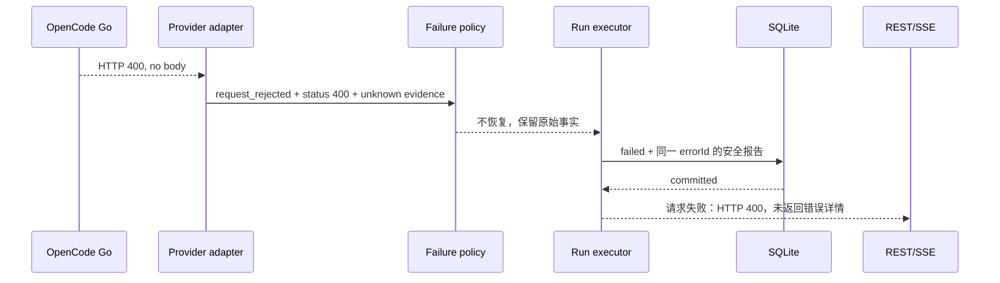

# Chat Run 统一异常处理设计

状态：首轮实现已落地，完整目标及剩余范围见第 13 节。审查及实施日期：2026-09-11。

## 1. 问题与范围

目标：在 provider → Agent → 恢复 → Run → REST/SSE 全链路使用同一份错误事实、同一套处置策略和同一个公开投影，避免原始错误被包装、恢复或本地化覆盖。

范围包含 Run 创建、附件水合、模型调用、压缩、工具及审批边界、消息与终态持久化、资源释放、事件传输、前端消费和重启恢复。工具内部的 SSH/SFTP 故障分类通过适配器接入；本次不重写整个 SSH 连接体系，不引入全仓库通用异常框架。

事实与推断分开：本次“你好”会话的空响应 400 被误判为上下文超限，已由日志、SQLite 和源码确认；下表其余故障路径由源码确认，实际影响属于待故障注入验证的风险，并非已发生事故。

## 2. 实施前链路与缺陷

源码入口均相对于仓库根目录。

| 阶段 | 文件 / 函数 | 已发现的问题 |
|---|---|---|
| 接收与创建 | `packages/ssh-agent/src/application/services/chat-service.ts` / `createRun` | 工作目录 stat 的所有错误被替换为“目录不可用”，没有 cause；先插入 pending Run 再创建 Runtime，创建失败缺少对应 Run 终态处理。 |
| 模型边界 | `packages/ssh-agent/src/application/provider-failure.ts` | 已有厂商原因提取与脱敏，但异常对象和流错误的诊断结构不统一；日志缺少 runId/requestAttemptId；`400 status code (no body)` 的字符串不符合当前状态码提取正则，可能只保留文本而丢失结构化 status。 |
| 超限分类 | `packages/ai/src/utils/overflow.ts` / `isContextOverflow` | Cerebras 的空响应 400/413 规则全局生效，未限定 provider。 |
| Agent 错误桥接 | `packages/agent/src/agent.ts` / `handleRunFailure` | 捕获异常后重建 AssistantMessage，只保留 message 和部分 code，丢失 cause、结构化诊断及发生阶段；后续写入失败可能再次进入相同事件处理路径。 |
| 自动恢复 | `packages/ssh-agent/src/application/services/chat-agent-runtime-factory.ts` / `recoverProviderError` | 根据 errorCode 启动压缩；恢复失败转换为新异常，未显式关联原始 provider 失败。回调收到 hasObservableOutput，但该桥接未用它限制恢复。 |
| 压缩 | `packages/ssh-agent/src/application/services/chat-context-service.ts` | “无可压缩历史”被归为 overflow；认证检查异常降为 false；失败事件没有 tokensBefore，而前端失败事件解析要求该字段。 |
| 压缩错误传递 | `packages/ssh-agent/src/application/chat-run-runtime.ts` | 通过私有 compactionFailure 和事件上的 Object.assign 补回展示信息；状态与消息存在两份事实；toAgentError 重建异常不保留 cause。 |
| 摘要调用 | `packages/ssh-agent/src/application/compaction-summary-request.ts` | 已保留 cause 和安全原因，但依赖可变的请求局部 failure，再包装为另一套错误类型，未与触发恢复的原始请求关联。 |
| 事件处理 | `packages/ssh-agent/src/application/services/chat-agent-event-handler.ts` | 同时决定模型下架、错误文案、持久化和事件发布；Terminal 状态更新空 catch；消息、Run、REST 投影各自决定错误分类与展示。 |
| Run 执行 | `chat-service.ts` / `executeRun` | 更新 running 在 try 外；外层 executeRun 空 catch；异常只归为 chat_run_failed；更新 Run 先修改内存后写数据库，写入失败时内存与持久化状态可能分歧。 |
| 审批 | `packages/ssh-agent/src/application/services/chat-approval-service.ts` / `request.finish` | 先标 settled、清理 pending，再写拒绝记录，最后 resolve；数据库抛错时 Promise 可能永远不结束；定时器回调没有错误归属。 |
| 队列 | `packages/ssh-agent/src/application/services/chat-queue-service.ts` | 先写队列，再注入 Agent，再发布事件；中途失败缺少补偿/状态收敛契约，不能仅靠通用 catch 修复。 |
| 持久化 | `packages/ssh-agent/src/infrastructure/sqlite/sqlite-chat-repository.ts` | 消息写入失败后 ROLLBACK 若也失败，会替换原始异常；终态、审批和队列的业务收尾缺少统一事务入口。 |
| HTTP / 本地化 | `packages/ssh-agent/src/i18n/public-error.ts`、`projection.ts` | 未知 HTTP 异常会分配 errorId 并记录日志；已知错误路径不保证诊断日志。递归投影再次根据 code 推断错误文案，Chat Run、Assistant、HTTP 不共享明确的失败 DTO。 |
| SSE | `packages/ssh-agent/src/application/chat-run-event-stream.ts` | broadcast 将编码与 enqueue 放在同一 catch 中，编码错误也被当作订阅者断连；structuredClone 异常能反向影响业务调用。 |
| Web | `packages/ssh-agent-web/features/chat/runtime/chat-event-stream.ts` | 无效事件直接返回 null；compaction.failed 的前后端结构不一致可能被静默忽略。 |

不是所有 catch 都应该上报错误。例如探测 JSON 格式失败、已关闭订阅者的 enqueue 失败是可预期分支。必须将这些分支与协议、存储、程序错误分别处理。

## 3. 核心约束

1. 首次识别失败时分配 errorId。重复传播同一失败不换 ID，不重新解析文案。
2. 分类依据是结构化证据；文本匹配只能位于明确的 provider 适配器，记录匹配规则。空 400 默认是原因未知的请求拒绝。
3. 统一错误事实，不将全部业务塞进一个 catch 或一个巨型 Service。
4. 原始失败、恢复失败、清理失败分别保留；追加关系不能覆盖根因。
5. 公共文案不是机器决策依据。语言切换不影响 code、恢复或 Run 状态。
6. 取消、审批拒绝、没有内容可手动压缩是正常结果，不包装成系统故障。
7. 工具的可预期执行失败可以交给模型处理；审批存储故障、内部不变量破坏必须停止 Run。
8. 先提交终态，再发布终态事件；客户端断连不改变 Run 结果。
9. 只有终态持久化已确认，才对客户端宣称 completed/failed/cancelled 已提交。
10. 在现有异常体系上演进。同一个异常只有一个分类入口、一份诊断身份和一个公开投影入口；不得另建 Chat 专属的平行异常框架。每次职责迁移必须同时移除原路径的对应实现。

## 4. 统一错误模型

以下三种对象是现有异常、持久化 failure 和诊断信息的职责划分，共享 errorId，不代表新增三套异常类型体系。

### 4.1 FailureFact：可持久化的错误事实

扩展现有 `domain/chat.ts` 中 ChatRun.failure 的结构，复用 `SshFailure` 已有的 code、category/phase、retryable 和安全细节约定。共享 errorId、关联标识、诊断关系可从既有领域类型提取到 `domain/errors.ts` 的公共元数据接口，不新增 Chat 专属基类。包含：

| 字段 | 含义 |
|---|---|
| errorId、occurredAt | 失败身份与时间 |
| code | 闭合联合类型；每个 code 必须有策略表项 |
| origin | provider / application / storage / transport |
| stage | admission / runtime_setup / context_prepare / provider_request / recovery / tool / approval / message_commit / run_commit / cleanup / delivery |
| requestId、sessionId、runId | 关联标识；创建前允许没有 runId |
| turnId、requestAttemptId、toolCallId | 在对应阶段必填，由运行范围分配；摘要请求也有独立 attempt ID |
| provider | 可选 providerId、modelId、HTTP status、upstreamCode、upstreamRequestId；不包含凭证或 URL 查询参数 |
| evidence | structured_code / provider_rule / local_check / unknown，以及规则标识；不能把推测写成确定超限 |
| safeReason | 通过边界清洗的具体原因；没有可公开原因时为空 |

复用既有 code：`chat_context_overflow`、`chat_context_no_compactable_history`、`chat_context_compaction_failed`、`chat_attachment_storage_unavailable` 等。只有既有 code 无法表达处理差异时才增加，例如 `chat_provider_request_rejected`、`chat_credential_check_failed`、`chat_approval_persistence_failed`。跨包的 pi-ai errorCode 与 SSH Agent 业务 code 只在边界映射一次；SSH/SFTP 的原有 code、category、phase 作为已知领域事实保留，不能重新推断为另一个 Chat code。

代码数量随可执行处理差异增长，不为每条异常字符串创建一个 code。

### 4.2 FailureOccurrence：进程内诊断

扩展既有 ChatError 的 options，使其支持 cause 和公共诊断元数据；ChatCompactionError 已有 cause/publicMessage，直接补齐公共元数据。ManagementError、SshAgentError 已支持 cause，保持原有类型与业务职责。禁止另加 ChatFailureError 包装所有领域异常。需要多个关联异常时在运行报告中保存关系。不要 JSON.stringify(Error) 充当序列化。

原始异常只能送入受控诊断器：保留堆栈、异常类型和递归 cause，屏蔽凭证，限制深度、长度并处理循环引用；不记录完整提示词、工具输出或任意响应对象。数据库和公开 DTO 不保存 raw cause。

### 4.3 FailureReport：一次失败的处置过程

包含 root FailureFact、recoveries 和 secondaryFailures。恢复记录含 attempt ID、结果（succeeded / failed / skipped）、失败事实或跳过原因；次要错误带关系 `cleanup_of`、`rollback_of`、`delivery_of`。

恢复成功后，该原始错误仍可在诊断日志中查到，但不能挂为最终 Run.failure。最后一次未恢复的失败是 Run 的主失败；终态提交失败另外报告，不能伪装成已提交业务失败。

取消使用独立 RunOutcome；先确定主结果再开始清理。晚到的取消信号不能覆盖已经确定的失败或完成结果。

## 5. 模块职责与收敛位置

| 模块 | 唯一职责 | 不允许承担的职责 |
|---|---|---|
| provider adapter（pi-ai） | 将 SDK 异常/流错误转换为通用结构化失败证据 | SSH Agent 文案、Run 终态、自动压缩 |
| 现有 `application/provider-failure.ts` | 唯一 provider 适配入口；补齐证据、ID、关联元数据，复用已有脱敏 | Run 终态、通用领域异常再分类 |
| 从现有 `i18n/public-error.ts` 提取的 `application/failure-policy.ts` | 统一既有已知领域异常识别、code 注册表、恢复条件和公共描述选择；保留来源信息 | 解析 provider 文本、访问数据库 |
| 共用 `application/failure-reporter.ts` | 从现有日志调用提取 errorId、脱敏、关联日志和去重；接入现有文件日志 | 新日志存储系统、修改业务结果 |
| 现有 `application/chat-run-runtime.ts` | 每个 Run/attempt 独立保存失败报告和恢复关系，替换 compactionFailure 特例 | 用“最后一条消息文本”推断结果 |
| `application/services/chat-run-executor.ts` | 拥有从已创建 Run 到终态提交及 finally 清理的生命周期 | 厂商专有解析、本地化 |
| 现有 `i18n/public-error.ts`、`i18n/projection.ts` | 委托唯一策略入口生成安全 DTO；按 locale 渲染；HTTP/SSE 共用 | 二次分类、重新设置 retryable |

`failure-policy.ts` 是将现有 public-error 中的规则提取成可被运行时和公开边界共同使用的模块；不是再写一份同名职责。public-error 保留原入口并委托该模块。这样运行决策无需依赖 HTTP 投影，同时整个系统仍只有一份规则。

现有 ChatError、ChatCompactionError、AttachmentError、SSH 领域错误继续表达各自业务事实，共同遵循 cause/诊断身份约定。共用策略入口对已知异常只提取既有事实，不再次包装或覆盖。多个领域异常类不等于多个异常体系；同一事实由不同模块反复分类、改写才是本次要消除的问题。

### 5.1 现有实现的保留、迁移与退出

| 现有实现 | 演进动作 | 最终不能残留的重复路径 |
|---|---|---|
| provider-failure 的提取、清洗和流包装 | 原位增强，消费 pi-ai 结构化证据 | 另一个 Chat normalizer 再解析 provider 文本 |
| public-error 的 instanceof 分支、CODE_MESSAGES | 提取到共用策略入口，原 API 委托 | 原文件和新注册表各保留一份规则 |
| normalizeSshFailure | 保留 SSH 边界分类，复用公共诊断身份；调用方沿用原有业务语义 | 同一未知异常在 SSH 和 HTTP 各生成一个 errorId |
| ChatRunRuntime.publicFailure、failureForRuntime | 统一调用共用策略和运行报告 | 两份 code/retryable 映射 |
| compactionFailure + annotateCompactionFailure | 迁移到 Runtime 的通用失败报告及 Agent 结构化传递 | 为恢复失败保留一条额外文案补丁链 |
| event-handler 的异常文案及模型错误识别 | 文案交公开投影；下架动作消费统一分类结果 | 在持久化事件处理器里再次解析厂商响应 |
| projection 的 Chat errorCode 兜底推断 | 消费统一已选描述，沿用现有本地化入口 | 与 Run 策略不同的第二份兜底分类 |
| 分散 console.error 和空 catch | 由既有文件日志承载统一 reporter 输出；有明确归属的后台任务 | 新日志后端与旧日志独立生成诊断 ID |

每个迁移步骤要附调用方检查：迁移后的请求路径必须只经过一个有效策略入口。禁止“先上新体系，旧体系留作兜底”作为完成状态。其他领域现有行为保持，共享入口的结构提取通过现有测试证明等价。

## 6. provider 与 Agent 的跨包协议

pi-ai 定义无 SSH Agent/i18n 依赖的失败证据类型。SDK 抛错和终态 error 事件都携带该结构；兼容厂商的特殊识别集中在适配层。Cerebras 空响应规则只能作用于明确适配范围，不能匹配其他 provider。

Agent 保留结构化失败信息，并提供原始运行异常的观测入口（例如 `onRunFailure`），在生成失败 AssistantMessage 前调用。SSH Agent 用该入口关联 errorId 和诊断；不得向 Agent 包传入 SSH Agent 的领域类或语言 key。

该入口失败必须单独记录，不能递归调用自身。致命事件监听器失败（例如 message_end 持久化失败）直接交给外层 Run owner，不能再次向同一个损坏监听器写“错误消息”。

工具入口区分可预期 ToolResult 与致命运行错误：保留业务工具失败反馈；为 Agent 定义明确的 fatal failure 契约并让 beforeToolCall/execute/afterToolCall 的 catch 原样上抛这种错误。否则审批数据库错误仍会被变成工具文本，模型可能继续执行。并行工具批次遇到致命错误时取消可取消任务，等待已启动任务收尾，记录无法确认的副作用；禁止自动重放整轮工具。

## 7. 恢复与重试策略

| 事实 | 处置 |
|---|---|
| 空响应 400，原因未知 | chat_provider_request_rejected；不压缩、不自动重试；公开原状态和“未返回错误详情” |
| 明确 context exceeded，无可观察输出 | 允许一次压缩恢复，再次请求一次；失败保留原请求和恢复原因 |
| 明确 context exceeded，已有文本或工具调用输出 | 默认停止自动恢复，保留部分输出；避免重复消息和工具副作用 |
| 本地阈值达到，但无历史可压缩 | 记录本地预检查事实与估算；不得声称 provider 已确认超限 |
| 手动压缩无历史 | skipped，不生成 FailureFact |
| 摘要请求 401/429/5xx | 作为恢复失败挂到原失败下；手动压缩时作为该操作主失败 |
| 认证检查抛错 | chat_credential_check_failed；不等同于凭证不存在 |
| 用户取消/审批拒绝/审批超时 | 独立取消或审批结果；存储失败另外升级为致命错误 |

`retryable` 拆成内部明确策略：是否暂时故障、允许的自动恢复动作、用户建议（修改输入/检查配置/稍后重试/联系维护者）。自动重试次数由执行器控制，首期不新增 429/5xx 自动重试。前端“恢复草稿”只是恢复输入，不代表可以安全重放工具操作。

## 8. Run 生命周期与持久化故障

### 8.1 创建和启动

创建前校验失败由 HTTP 请求 owner 处理。Run 插入后，必须立即交由 executor 管理；Runtime 创建、更新 running、prompt 全部位于其 try/finally 内。创建后 setup 失败按同一 Run ID 记录 failed；持久化可用时，同 requestId 查询得到相同结果。

所有启动失败均释放 lease 和 Terminal binding。保留“无 Runtime 但已有 Run”的分支，不能要求 runtime 存在才能完成失败处理。

### 8.2 终态

executor 形成 RunOutcome 后调用单一 finalize 操作。构造新快照，使用预期状态条件更新；数据库提交成功后才替换内存快照、发布 run.updated。终态提交幂等，重入不得重复用户消息、工具执行或失败记录。

失败报告摘要、Run 终态以及该 Run 的 pending 队列/审批关闭尽可能在同一个 SQLite 事务中完成。Repository 提供显式聚合方法，避免嵌套 BEGIN。Terminal 的独立生命周期通过可重入解绑处理。

数据库写入失败后，保留原业务结果及 `run_commit` 失败，尝试有上限的幂等提交（仅暂时性 busy 等，禁止无限重试）。仍失败时：

- 将当前执行标记为“已停止、终态未持久化”的进程内状态；它不是对数据库终态的伪造。
- 停止 provider/tool 工作并释放资源；保留按 sessionId 的轻量阻塞记录，拒绝新 Run，避免与数据库的 active 唯一约束冲突。
- 发出尽力而为的 `run.persistence_failed` 通知，REST 在该进程内返回明确的终态未确认错误；客户端不能显示 completed。
- 提供受监督的有限重试收敛入口；成功后清除阻塞记录并发布真实终态。进程重启仍使用 interrupted recovery 收敛数据库遗留记录。

数据库和进程同时丢失时不能保证错误报告持久化，本地日志为诊断兜底；首期不新增独立事件数据库或 durable outbox。此限制必须在验收中明确。

### 8.3 审批、队列和清理

审批等待的 Promise 必须 resolve 或 reject 一次。持久化失败 reject 为明确致命错误；所有路径 finally 清理 timer/listener/pending。定时器和 abort 回调捕获并转交 Promise，不产生无主异常，也不能凭空返回批准。

队列写入、Agent 注入、消费确认分别标明失败阶段。注入失败时取消对应 pending 项；补偿写入失败升级为存储故障并停止该 Run。数据库队列不能被假定为已注入 Agent。

清理采用逐项执行、收集失败的方式；一个 cleanup/rollback 失败不阻止其他清理，也不替换原失败。关闭服务需要等待已启动任务的有限收尾，不能只调用 void dispose。无界后台任务与空 catch 替换为有 operation 名称和关联范围的受监督执行。

## 9. 持久化、REST/SSE 与前端统一契约

失败报告的安全快照写入 Run 的 failure_json；相关失败消息携带相同 errorId 和安全失败投影。快照包含 schemaVersion，读取时验证结构。raw cause 只进诊断日志。恢复成功的中间错误首期只保留在日志/恢复事件中，不扩展消息历史污染模型上下文。

公开 `ChatFailureView` 统一包含：errorId、code、stage、message、action，以及可选的 provider/status/upstreamCode 和 recoverySummary。HTTP 外层 status 与 upstreamStatus 分开：provider 401 不能变成 SSH Agent 用户登录失败；业务运行异步失败通过 Run 状态表达，不能在 SSE 连接建立后改 HTTP status。

REST Run、历史消息、message_end、compaction.failed、run.updated 使用同一个投影器。i18n 只根据已选定描述本地化；不得按兜底 code 再次覆盖具体厂商原因。明确字段白名单，避免通过递归删字段实现信息边界。

首期同步更新后端和 Web 契约，取消多套 Chat 错误映射；旧历史不能恢复已丢失的原因。不解析旧文案猜测厂商原因，不重写历史失败。旧格式历史的处置在实施迁移中显式确定，不隐式加入长期双协议支持。

前端按 errorId 合并同一次失败在消息、压缩和 Run 处的重复提示；保留不同 Run 的独立失败。详细面板可显示恢复失败，不挤占主错误。无效已知 SSE 事件必须记录协议诊断并触发 REST 重同步；未知扩展事件可忽略。

SSE 编码与订阅者写入分开：编码错误归为 delivery 故障并记录，enqueue 因客户端关闭失败只移除订阅者。按 locale 缓存编码结果。已持久化 Run 不因 delivery 失败改成失败；重连通过 REST 快照补齐，SSE 内存历史不是持久化事实来源。

## 10. 日志与错误归属

首次边界规范化后 reporter 记录一次诊断，传播层不重复打印堆栈。恢复决策、恢复完成、终态提交和清理各记结构化事件，通过 errorId/rootErrorId/requestAttemptId 关联。

创建前的异常由 HTTP 请求 owner 负责；已创建 Run 的执行与收尾由 executor 负责；独立手动压缩由操作 owner 负责；后台投影/清理由任务 supervisor 负责。纯 normalizer/projector 不打印日志。

通用字段：event、stage、errorId、rootErrorId、requestId、sessionId、runId、turnId、requestAttemptId、providerId、modelId、code、upstreamStatus、rule、recoveryAction。并非每个阶段都有所有 ID，但可用的 ID 必须携带。

logger 自身失败使用最小 stderr 兜底，不把日志失败重新送入 reporter 形成递归。用户输入错误按 info，已恢复故障/次要故障按 warn，未恢复运行和存储故障按 error。

## 11. 本次事故在新链路中的行为

若明确超限而压缩失败，主事实仍为 chat_context_overflow，recoverySummary 为“自动压缩失败：具体原因”；日志中两个错误通过 rootErrorId 关联。若随后清理失败，只新增 secondaryFailure。

## 12. 实施顺序与验收

1. 从现有 public-error 提取单一策略入口，扩展现有异常/Run.failure 元数据并接入共用诊断器；先用既有各领域测试确认提取行为等价，再用本次空 400 构造贯通测试锁定修正预期。
2. 修改 pi-ai 的 provider 证据与超限分类、Agent 的失败传递和 fatal tool 契约；使用 faux provider，不调用真实厂商。
3. 接入 provider、附件、压缩边界和 Run failure state，移除 Chat 路径的重复分类及可变描述符补丁。
4. 抽出 executor，修复创建/启动/审批等待/队列补偿/终态提交/清理归属，接入持久化未确认处理。
5. REST/SSE/Web 同步切换投影；移除 Chat 旧映射，修复压缩失败事件契约与协议诊断。
6. 更新相关 AI repo 功能文档并核对源码后刷新 manifest；执行指定测试及 npm run check。其他会话的 manifest 修改不得覆盖。

| 故障注入场景 | 必须验证的结果 |
|---|---|
| 新会话、OpenCode Go 空 400 | 不调用压缩；消息/Run/REST/SSE 相同 errorId、status 和原因 |
| Cerebras 特定规则 / 其他 provider 相同文本 | 只在指定适配范围生效 |
| 明确超限、压缩成功 | 最多一次恢复重试；最终成功无残留失败 |
| 明确超限、无历史 / 摘要 401 / 摘要 5xx | 根因与恢复原因同时保留，动作符合策略 |
| 已输出内容后 provider 失败 | 保留部分输出，不自动重复请求/工具 |
| provider 同步 throw / 流中 error / 消费流 throw | 相同语义得到相同 code；结构化信息不丢失 |
| Runtime 创建失败 / running 写入失败 | 无活动资源泄漏；已插入 Run 收敛或明确阻塞 |
| message_end 持久化失败 | 不递归写错误消息，不误判 provider 失败 |
| 审批超时/取消时数据库失败 | 等待 Promise 必定结束，未授权工具不执行 |
| 队列注入及补偿失败 | 状态有明确归属，不继续不确定执行 |
| 主异常 + rollback/cleanup 异常 | 根因不变，次要错误可追踪，其他清理继续 |
| 终态提交失败 | 不发布虚假终态，不允许新 Run 穿透，幂等收敛可恢复 |
| SSE 编码失败 / 客户端断连 | 分别诊断；不改变已提交 Run 结果 |
| compaction.failed / 无效已知事件 | 正确消费；无效协议可观测且触发重同步 |
| 取消与失败竞态 / 重启恢复 | 单一终态规则，禁止工具自动重放 |
| 中文/英文、重连与历史读取 | 除 message 外身份及语义一致 |
| 含凭证 cause、HTML、循环异常对象 | 日志可用且脱敏；公开输出无内部诊断泄漏 |
| 同一 SSH/附件/压缩异常跨 Run、REST、SSE | 保留原 code/cause/errorId，只有一个策略来源 |
| 迁移完成的调用链检查 | 无新旧双 normalizer、双注册表、双 errorId 生成或旧 Chat 文案兜底路径 |

实施过程中如需删除现有有意设计的行为，应逐项明确变更并按仓库规则取得确认；统一错误表达本身不能成为删除恢复能力的理由。

## 13. 首轮实现与剩余范围

本节记录实际交付；前面的完整目标不代表每项均已实现。源码导航见 [统一失败处理](../ai-repo/chat-failures.md)。未修改用户数据库或历史记录，未重启运行中的服务。

已实现：

- 将既有 public-error 分类实现迁移到 failure-policy，原入口只重新导出；复用既有领域异常，统一诊断身份、cause、日志脱敏及去重，没有新增统一异常基类或另一套注册表。
- 修正 Cerebras 空响应规则的适配范围；其他厂商空 400 保留请求失败与 HTTP 状态。provider、Agent、Run、消息和 REST/SSE 共用安全失败快照，恢复失败附在原失败下。
- Agent 原始异常观测、致命监听器失败直达执行器、致命工具失败传播及并行任务取消收尾。审批存储失败结束等待；队列注入失败补偿，补偿失败停止运行。
- 分离 Run 执行与清理；先提交数据库再更新内存及发布终态，终态同时关闭 pending 审批和队列。提交失败阻止新 Run/手动压缩，通过后续活动查询或创建请求重试同一提交，不重放模型或工具。
- REST/SSE 公共失败字段白名单、诊断 ID、恢复原因本地化；编码故障触发重同步。Web 按 errorId 合并消息与 Run 提示，保留部分输出及历史诊断信息。

仍需后续落实，不能视为本轮验收完成：

- pi-ai 所有 SDK 适配器统一结构化失败证据、规则标识及 upstreamRequestId；目前沿用已有 diagnostics，并保留 provider 边界的文本识别。
- 完整 FailureFact/FailureReport 类型：当前安全快照为 schemaVersion 1，包含 code、errorId、stage、action、upstreamStatus 及单次恢复摘要；尚未包含闭合 code 联合、完整 evidence/origin、全部关联 ID 和次要错误关系图。次要错误当前记录在诊断日志中。
- 终态提交的后台有限重试调度、按暂时性数据库错误选择重试；目前采用访问触发的幂等收敛。后台 Terminal 投影已有错误归属，但尚未统一为可等待的任务监督器。
- 并行工具不可确认副作用的结构化记录、手动压缩的服务关闭收尾，以及完整取消/失败竞态与故障矩阵。现有中断恢复沿用原实现，未重新设计。
- 历史无版本 failure 仍按现有读取路径展示，不回填丢失的原因；新快照做基础结构验证，尚未实现完整嵌套 schema 校验。日志按结果细分级别也未完全落实。

本轮验证：248 个定向测试通过（SSH Agent 156、Agent 55、AI 2、Web 35），覆盖空 400 贯通、恢复根因保留、监听器故障、审批持久化失败、终态提交阻塞与恢复、SSE 编码以及前端重复提示。根目录 npm run check 通过；Web 生产源码独立类型检查通过。Web 全量 lint/tsconfig 存在既有 Hook 规则、测试导入与 Vite 类型问题，未作为通过项。上述测试数量不是第 12 节全部故障矩阵均已覆盖的声明。
