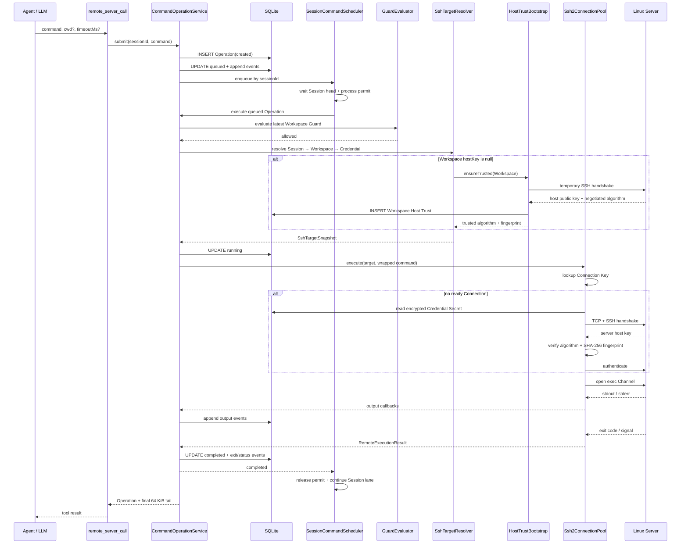

# SSH Connection Pool 与远程命令执行设计

本文说明 SSH Agent 当前实现的三个方面：为什么这样设计、核心类如何分工，以及一条 Agent 命令从 Tool 调用到 Linux 服务器执行完成的全过程。

本文是帮助理解实现的设计说明。代码是最高优先级事实；发生差异时，以文末列出的源码为准。

## 1. 设计目标

SSH Agent 需要解决的不是“调用一次 ssh 命令”，而是建立一个可长期演进的执行内核：

- Agent 只表达“执行什么命令”，不处理 SSH Connection、Channel 和 Credential。
- 多次命令复用已经建立的 SSH Connection，避免重复握手和认证。
- 每次命令使用独立的 exec Channel，不让 Session 长期占用物理 Connection。
- 命令必须先经过 Session 内 FIFO、进程并发许可和 Guard，不能绕过安全检查直接操作 Channel。
- 命令的内部状态、输出和失败可以持久化审计，最终结果通过 Pi 的标准 Tool 生命周期返回。
- 网络中断时不能盲目重放命令，避免同一操作在服务器上执行两次。
- SSH 专属实现留在 `ssh-agent`，`agent-core` 只提供通用的结构化 Tool Error 能力。

最终边界如下：

```text
Agent / agent-core
        │
        │ remote_server_call(command, cwd?, timeoutMs?)
        ▼
CommandOperationService
        │
        ├── SQLite Operation/Event audit
        ├── Per-Session FIFO
        ├── Process permit limiter (default 16)
        ├── Guard evaluation
        └── Session → Workspace → active Credential
                         │
                         ▼
                  SshChannelBroker
                         │
                         ▼
                 Ssh2ChannelBroker
                  ├── Ssh2ExecCommandBroker
                  ├── Ssh2SftpFileBroker
                  └── Ssh2ConnectionPool
                         └── Physical SSH Connection + Channel slots
```

## 2. 关键领域关系

### 2.1 Session、Workspace 与 Credential

Tool 创建时绑定 `sessionId`，但不会把 `workspaceId`、hostname、port 或 Credential 暴露给模型。

执行时由后端完成以下解析：

```text
Session
  └── workspaceId
        └── Workspace
              ├── hostname / port
              ├── trusted host key
              ├── connection options
              ├── defaultCwd
              └── activeCredentialId
                    └── Credential metadata + encrypted Secret
```

这保证模型不能通过 Tool 参数切换服务器或凭据。Workspace 的活动 Credential 发生变化后，下一条命令自然解析到新的认证配置。

### 2.2 执行目标快照

`DefaultSshTargetResolver` 把分散的 Session、Workspace 和 Credential 数据解析成一次执行使用的不可变快照：

```ts
export interface SshTargetSnapshot {
  workspaceId: WorkspaceId;
  workspaceRevision: number;
  hostname: string;
  port: number;
  hostKeyAlgorithm: string;
  hostKeyFingerprint: string;
  credentialId: CredentialId;
  credentialAuthVersion: number;
  remoteUser: string;
  defaultCwd: string;
  connectTimeoutMs: number;
  keepaliveIntervalMs: number;
  keepaliveMaxCount: number;
}
```

Operation 保存该快照的目的不是保存 Secret，而是记录“这次命令具体使用了哪个目标和哪个认证版本”。密码、私钥和 passphrase 永远不进入 Operation。

## 3. Connection Pool 设计

### 3.1 Agent 为什么不直接获取 Connection 或 Channel

Connection 是包含 TCP、SSH 握手、主机校验、认证、保活和重连状态的基础设施对象。如果直接交给 Agent 或 Tool，会导致：

- Tool 必须理解连接状态和重试规则。
- Guard、审计和输出采集容易被绕过。
- 上层可能错误地重用或关闭共享 Connection。
- SSH 基础设施细节进入 Agent 编排代码。

因此应用层按能力依赖窄接口：Command Service 只使用 `RemoteCommandBroker`，SFTP Service 使用 `SftpFileBroker`，管理能力使用 `SshConnectionPoolControl`。组合类型只用于运行时装配：

```ts
export interface RemoteCommandBroker {
  execute(input: ExecuteRemoteCommandInput): Promise<RemoteExecutionResult>;
}

export interface SftpFileBroker {
  listDirectory(input: SftpPathInput): Promise<DirectoryResult>;
  stat(input: SftpPathInput): Promise<SftpDirectoryEntry>;
  upload(input: UploadRemoteFileInput): Promise<RemoteUploadResult>;
  download(input: DownloadRemoteFileInput): Promise<RemoteDownloadResult>;
  deleteFile(input: SftpPathInput): Promise<void>;
}

export interface SshConnectionPoolControl {
  snapshotWorkspace(workspaceId: string): ConnectionPoolSnapshot;
  invalidateWorkspace(workspaceId: string): void;
  invalidateCredential(credentialId: string): void;
  close(): void;
}

export interface SshChannelBroker
  extends RemoteCommandBroker, SftpFileBroker, SshConnectionPoolControl {}
```

`Ssh2ChannelBroker` 组合一个共享 Pool 以及独立的 Exec/SFTP adapter。`Ssh2ConnectionPool` 只提供受 Channel slot 约束的 infrastructure callback；原始 `ssh2.Client` 不会越过 `infrastructure/ssh`。Exec 和 SFTP adapter 分别完成各自的 Channel 创建、输出、取消和关闭。

### 3.2 Connection Key 为什么不能只有 hostname + port

同一个 Linux 服务器可能出现以下情况：

- 两个 Workspace 对同一主机采用不同的信任记录。
- 同一主机使用不同 remote user。
- 活动 Credential 被切换。
- Credential 的认证材料被轮换，`authVersion` 增加。

如果只用 `hostname + port`，新命令可能错误复用由旧用户或旧 Credential 建立的 Connection。

当前 Connection Key 是：

```text
workspaceId
+ hostname
+ port
+ hostKeyAlgorithm
+ hostKeyFingerprint
+ credentialId
+ credentialAuthVersion
+ remoteUser
```

不进入 Key 的字段包括：

- `workspaceRevision`：显示名称等无关修改不应重建连接。
- `defaultCwd`：cwd 属于单次命令。
- timeout 和 keepalive 配置：用于建立或管理 Connection，但不代表认证身份。
- Credential Secret：不能出现在 Map Key、日志或审计数据中。

### 3.3 Pool 的容量和生命周期

当前默认值：

| 配置 | 默认值 | 含义 |
|---|---:|---|
| 每个 Connection 最大 Channel | 8 | 为将来的并发执行保留容量 |
| Channel 获取超时 | 15 秒 | Connection Channel 满载时的最长等待 |
| Connection 空闲保留 | 60 秒 | 无活动 Channel 后延迟关闭 |
| 首次连接尝试 | 1 次 | 配置、认证或目标错误应立即反馈 |
| 断线重连 | 最多 5 次 | 只针对曾经 ready 的 Connection |
| 重连退避 | 0.5、1、2、4、8 秒 | 加入 ±20% 抖动 |

Connection Pool 本身支持一个 Connection 上的多个 Channel。Agent 命令按照 Session 分队列：同一 Session 严格串行，不同 Session 可以并发，因此同一个 ready Connection 可以实际承载多个 Session 的 exec Channel。进程级许可器默认最多允许 16 个 Operation 执行，而每个 Connection 仍最多允许 8 个 Channel；两层限制分别保护进程总资源和单连接容量。

Channel slot waiter 使用 FIFO。等待期间 AbortSignal 触发时，waiter 会立即从队列移除并清理 timeout/listener；不会等到 15 秒超时，也不会在后续容量释放时获得一个已经取消的 slot。

Connection attempt 是 Pool 显式拥有的资源。Workspace/Credential 失效或后端关闭会同时取消 waiter、重连 delay 和尚未 ready 的 Client；ready 回调在写回 Pool 前再次验证 Entry 身份，避免已失效连接变成游离资源。

### 3.4 主机密钥校验

Workspace 创建时只保存 hostname 和 port，`hostKey` 初始为 `null`。第一次 Tool 调用解析目标时，`DefaultWorkspaceHostTrustService` 按 Workspace 执行 single-flight Bootstrap：

```text
hostKey = null
  → 临时 ssh2 握手
  → hostVerifier 读取服务器公钥
  → handshake 事件读取实际协商算法
  → 计算 SHA-256 指纹
  → INSERT workspace_host_trusts
  → 销毁探测连接
```

探测连接不创建 Channel，也不读取或发送业务 Credential。相同 Workspace 的并发首次命令共享一个 Promise；SQLite 主键和 `INSERT ... ON CONFLICT DO NOTHING` 继续处理跨进程竞争。如果竞争写入的算法或指纹不同，Bootstrap 返回 `host_key_mismatch`，不能覆盖先写入的信任记录。

建连时 Pool 限制服务器使用 Workspace 保存的主机密钥算法，并通过 `hostVerifier` 计算服务器公钥的 SHA-256 指纹：

```ts
hostVerifier: (key: Buffer) => {
  observedFingerprint = fingerprint(key);
  return observedFingerprint === target.hostKeyFingerprint;
}
```

Bootstrap 持久化成功后才允许建立正常认证 Connection。正常 Connection 的校验发生在用户认证和 Channel 创建之前；算法或指纹不一致产生 `host_key_mismatch`，不会自动接受新密钥。自动 TOFU 只固定第一次观察结果，不能证明首次连接未遭遇中间人攻击；预置信任、重新信任和 SSH CA 仍属于后续任务。

### 3.5 Credential Secret 的读取时机

Connection Key 和目标快照只包含 `credentialId + credentialAuthVersion`。只有真正需要建立物理 Connection 时，Pool 才从 `CredentialSecretStore` 解密并读取 Secret：

```ts
const secret = await secrets.get(
  target.credentialId,
  target.credentialAuthVersion,
);
```

已经 ready 的 Connection 被复用时，不会重复读取 Secret，也不会重复认证。

### 3.6 断线与自愈

必须区分两个场景：

1. 首次连接失败：直接返回连接、认证或主机信任错误，不进行五次自动重试。
2. 已 ready 的 Connection 意外断开：为后续 Channel 在后台执行最多五次重连。

如果断线发生在命令运行期间，系统不知道命令是否已在远端完成。例如部署命令可能已经执行成功，只是 exit code 没有传回来。此时 Operation 进入 `uncertain`：

```text
Connection lost while command is running
             │
             ├── active Operation → uncertain
             ├── never replay command automatically
             └── reconnect for future commands
```

这是一个安全约束，而不是普通重试策略。只有用户或 Agent 在理解命令幂等性的情况下，才能显式再次提交命令。

### 3.7 主动失效

以下管理动作会主动销毁相关连接：

- Workspace 切换到另一个活动 Credential。
- Workspace 被删除。
- Credential 被删除。
- 后端关闭。

同一个 Credential 的幂等激活不会重建连接。连接失效只影响运行时资源，不删除 Workspace、Credential 或 Operation 数据。
切换 Credential 同样不会删除 Workspace Host Trust；新 Credential 建立 Connection 时继续验证原来的算法和指纹。

## 4. Command Operation 与 Per-Session FIFO

### 4.1 为什么需要 Operation

一次 Tool 调用不是一个瞬时函数调用。它会经历排队、安全检查、目标解析、连接、Channel、执行和结束。Operation 用于统一表达这个生命周期：

```ts
export type CommandOperationStatus =
  | "created"
  | "queued"
  | "dispatching"
  | "running"
  | "completed"
  | "failed"
  | "cancelled"
  | "blocked"
  | "uncertain";
```

主要状态流转：

```text
created → queued → dispatching → running → completed
                    │             ├──────→ failed
                    │             ├──────→ cancelled
                    │             └──────→ uncertain
                    └────────────────────→ blocked

queued ─────────────────────────────────→ cancelled
```

`dispatching` 表示已经离开队列，正在进行 Guard、目标解析和执行准备；`running` 表示已经开始进入 SSH 执行阶段。

### 4.2 为什么 Session FIFO 在 Channel Broker 之前

如果 Tool 直接调用 Broker，多个 Agent Tool Call 会立刻争抢 Connection 和 Channel，Guard 和审计只能分散在每个调用点中。

当前流程是：

```text
Tool submit
   → persist Operation
   → enqueue Session FIFO
   → Session lane head
   → acquire process permit
   → Guard
   → target resolution
   → Channel Broker
```

`SessionCommandScheduler` 使用 `Map<SessionId, SessionLane>` 隔离命令顺序。每个 Lane 只有一个消费者，所以同一 Session 的命令严格按照入队顺序执行；不同 Session 的 Lane 可以并发。

Lane 队首在进入 `dispatching` 前必须取得公平的进程许可。默认最多 16 个 Operation 同时持有许可，许可覆盖 Guard、目标解析、Channel 获取和远端执行，并在所有终态路径释放。每个 Session 同时只有一个队首进入许可等待，避免单个 Session 用大量命令占据全局许可等待队列。

`queued` 表示命令正在等待同 Session 前序命令，或者正在等待进程许可。排队默认上限为 60 秒；到期或收到派发前取消时会立即标记为 `cancelled`，返回 `queue_timeout` 或 `cancelled_before_dispatch`。已经过期的调度项会被 Lane 跳过，永远不会执行 SSH 命令。

Session Lane 和进程许可当前只保存在内存中。SQLite 保存 Operation 和 Event，但服务重启后不会重新执行旧命令：

- 旧 `queued/dispatching` Operation 变为 `cancelled`。
- 旧 `running` Operation 变为 `uncertain`。

这样可以避免进程重启后重复执行非幂等命令。

### 4.3 Guard 为什么在消费时检查

Guard 不能只在命令入队时检查，因为命令等待期间 Guard 配置可能发生变化。

消费者取到命令后读取最新 Guard：

```ts
const decision = await guards.evaluate(
  operation.workspaceId,
  operation.command,
);
```

匹配顺序按照 Guard 中的规则顺序，支持：

- `contains`
- `starts_with`
- `regex`

命中后：

- 不解析 Credential Secret。
- 不获取 Connection 或 Channel。
- Operation 进入 `blocked`。
- 保存 `guardRevision` 和 `matchedGuardRuleId`。
- Tool 抛出 `AgentToolError`，设置 `terminate: true`。
- 调用上层注入的 `abortRun()`。

因此 Guard 是执行入口的强制关卡，而不是 UI 提示。

### 4.4 cwd 和远程命令包装

Tool 支持：

- 绝对 Linux 路径，例如 `/srv/app`。
- `~`。
- `~/project`。

cwd 使用 Shell 引号安全包装，然后再拼接 Agent 提供的命令：

```text
cd -- '<resolved cwd>' && <agent command>
```

`~` 和 `~/...` 使用远端 `$HOME` 解析。cwd 只负责选择工作目录；command 本身是 Agent 明确要求服务器执行的 Shell 命令，不会被当成普通字符串转义。

### 4.5 超时与取消

默认命令执行超时为 5 分钟，允许的最大值为 30 分钟。Tool 的 AbortSignal 和执行超时共同控制当前 Channel：

- 用户或 Agent Run 取消：`execution_cancelled`。
- 超过 timeoutMs：`execution_timeout`。
- Broker 尝试向远端 Channel 发送 `KILL`，然后关闭本地 Channel。

取消只作用于当前执行，不会关闭同一 Connection 上未来可能使用的 Channel。

### 4.6 输出策略

stdout 和 stderr 通过 Broker 回调到 `CommandOperationService`，随后同时进入两条路径：

```text
SSH stdout/stderr chunk
        ├── SQLite Operation Event：最多前 10 MiB
        └── LLM Output Tail：始终保留最后 64 KiB
```

超过 10 MiB 后：

- 命令继续执行。
- 不再持久化新的输出 chunk。
- 只写入一次 `output_truncated` 事件。
- `outputBytes` 仍记录真实接收量。
- Tool 完成时向 LLM 返回最后 64 KiB，并注明早期内容被截断。

持久化限制用于保护 SQLite；LLM tail 限制用于控制上下文大小。两者是不同目的，不能合并为一个限制。

## 5. Tool 与 agent-core 的边界

### 5.1 Tool 参数

`remote_server_call` 的参数只有：

```ts
{
  command: string;
  cwd?: string;
  timeoutMs?: number;
}
```

Tool 由后端按 Session 创建：

```ts
const tool = backend.createRemoteServerCallTool(
  sessionId,
  abortRun,
);
```

因此 `sessionId` 也不是模型参数。模型无法在一次 Tool Call 中指定另一个 Session 或 Workspace。

### 5.2 Tool 的职责

Tool 本身只做三件事：

1. 将参数和后端绑定的 Session 提交给 `CommandOperationService`。
2. 将最终成功结果转换为 agent-core Tool Result。
3. 将最终失败转换为包含准确 `SshFailure` 的 `AgentToolError`。

SSH 连接、Guard、队列、Channel 和输出处理均不在 Tool 中实现。

### 5.3 结构化 AgentToolError

普通 JavaScript Error 只有 message，前端无法稳定区分 Guard、认证和网络错误。因此 `agent-core` 增加了通用错误类型：

```ts
export class AgentToolError<TDetails = unknown> extends Error {
  readonly content?: (TextContent | ImageContent)[];
  readonly details: TDetails;
  readonly terminate: boolean;
}
```

Agent loop 捕获它后，保留：

- 给 LLM 的安全 content。
- 给日志和前端的结构化 details。
- `isError: true`。
- 是否终止当前 Tool batch 的 `terminate`。

`agent-core` 不认识 `host_key_mismatch` 或 `guard_blocked`。SSH 错误码仍由 `ssh-agent` 定义，从而保持 core 的通用性。错误 `content` 包含给 LLM 判断所需的准确 code、category、phase、retryable 和安全 message；`details.failure` 保存相同的结构化终态供日志和 UI 使用。

## 6. 异常体系

所有 SSH 失败归一化为：

```ts
export interface SshFailure {
  code: SshFailureCode;
  category: SshFailureCategory;
  phase: SshFailurePhase;
  message: string;
  retryable: boolean;
  operationId?: OperationId;
  sessionId?: SessionId;
  workspaceId?: WorkspaceId;
  safeDetails?: Record<string, string | number | boolean>;
}
```

三个维度的职责不同：

| 字段 | 用途 | 示例 |
|---|---|---|
| `code` | 稳定的程序判断 | `host_key_mismatch` |
| `category` | UI 和日志归类 | `host_trust` |
| `phase` | 定位失败发生阶段 | `verify_host` |
| `message` | 人类可读安全说明 | 主机指纹不匹配 |
| `retryable` | 描述错误性质 | 网络暂时不可达可能为 true |

`retryable: true` 不等于允许自动重放命令。它只说明底层错误可能是暂时的；命令是否可以再次执行仍取决于幂等性和 Operation 状态。

主要错误类别：

- `request`：非法命令、Session 不存在。
- `queue`：排队超时、服务关闭、派发前取消。
- `guard`：规则阻断或 Guard 配置非法。
- `host_trust`：主机算法不支持、指纹不匹配。
- `connection`：DNS、拒绝连接、超时、网络不可达、传输中断。
- `authentication`：认证失败、Secret 不可用。
- `channel`：Channel 获取或打开失败。
- `execution`：非零退出、信号、执行超时、结果不确定。
- `persistence`：Operation 或输出事件保存失败。
- `internal`：无法安全分类的内部错误，只对外提供 errorId。

`safeDetails` 只能保存安全诊断信息，不能保存 Credential Secret 或未经审查的底层错误文本。

## 7. Operation Event 与前端

SQLite 保存的事件类型包括：

```text
status
stdout
stderr
exit
output_truncated
```

这些事件仅用于后端审计、状态恢复和输出裁剪，不映射到 Tool `onUpdate`，也不进入 Pi `AgentEvent`。前端只使用 Pi 已有的 `tool_execution_start` 和 `tool_execution_end` 判断 Tool 正在执行、成功或失败。最终失败的准确 `SshFailure` 通过 `AgentToolError.details.failure` 保留；LLM 通过最终 Tool Result `content` 获取同样的判断信息和远端输出尾部。

当前没有单独的 Operation HTTP API，也没有命令 Operation WebSocket/SSE。Connection Pool 不依赖 UI 或网络传输协议。

## 8. 端到端执行流程

下面是一条命令成功执行时的完整时序：



对应的文字流程：

1. LLM 调用 `remote_server_call`。
2. Tool 补入后端绑定的 `sessionId`。
3. Service 校验 command 和 timeout。
4. 读取 Session，确定 Operation 的 Workspace 所有权。
5. 依次记录初始 Operation 和状态事件。
6. Operation 进入对应 Session 的内存 FIFO。
7. Session 队首等待进程许可；排队超时或取消会主动退出。
8. 取得许可后读取最新 Guard；命中规则则立即 blocked。
9. 解析最新 Workspace、活动 Credential 和连接参数；Host Trust 不存在时执行一次 Workspace 级自动 TOFU。
10. TOFU 持久化成功后生成包含算法和指纹的目标快照。
11. 解析 cwd，创建执行超时和 AbortSignal。
12. Broker 按 Connection Key 获取或创建 ready Connection。
13. 新 Connection 读取 Secret，在 SSH 握手中先严格校验主机，再发送 Credential 完成认证。
14. Broker 创建 exec Channel，转发 stdout/stderr。
15. Service 持久化输出、exit 和最终状态。
16. Scheduler 释放进程许可，并消费该 Session 的下一条命令。
17. Tool 返回输出尾部和结构化 details。
18. agent-core 把 `tool_execution_end` 和最终 Tool Result 交给后续 Run 传输层。

## 9. 失败流程示例

### 9.1 Guard 阻断

```text
queued
  → dispatching
  → Guard matches rule
  → blocked
  → AgentToolError(guard_blocked, terminate=true)
  → abortRun()
```

整个过程中不会读取 Credential Secret，也不会建立 Connection。

### 9.2 主机指纹不匹配

```text
running
  → SSH handshake receives host public key
  → computed fingerprint != Workspace fingerprint
  → host_key_mismatch
  → failed
```

失败发生在认证前，Pool 不保存该 Connection，也不会自动接受服务器返回的新密钥。

### 9.3 命令执行期间断线

```text
running
  → transport closes before reliable exit result
  → execution_result_uncertain
  → uncertain
```

Pool 可以为后续命令重连，但当前 Operation 不会重放。

### 9.4 服务重启

Session FIFO 在内存中，进程结束后无法确认旧命令的真实运行位置：

```text
queued / dispatching → cancelled(service_restarted_before_dispatch)
running              → uncertain(execution_result_uncertain)
```

## 10. 运行时装配

`createSqliteManagementBackend()` 是当前默认组合入口，负责创建并连接：

```text
SQLite repositories
  ├── Workspace / Session / Credential / Guard
  └── CommandOperationRepository

CredentialSecretStore
  └── Ssh2ChannelBroker
        ├── Ssh2ExecCommandBroker
        ├── Ssh2SftpFileBroker
        └── Ssh2ConnectionPool

WorkspaceHostTrustRepository + Ssh2HostKeyProbe
  └── DefaultWorkspaceHostTrustService

SessionRepository + WorkspaceRepository + CredentialRepository + HostTrustService
  └── DefaultSshTargetResolver

GuardRepository
  └── DefaultCommandGuardEvaluator

OperationRepository + Resolver + Guard + Pool
  └── CommandOperationService
        ├── SessionCommandScheduler
        │     ├── one FIFO lane per Session
        │     └── fair process permit limiter (default 16)
        └── createRemoteServerCallTool(sessionId, abortRun)
```

这一装配保证运行时只有一个 Pool、一个 CommandOperationService 和一个 Scheduler。Scheduler 允许不同 Session 并发，但通过 `maxConcurrentOperations` 限制单进程总执行量；默认值为 16，CLI 可用 `SSH_AGENT_MAX_CONCURRENT_OPERATIONS` 覆盖。

## 11. 当前边界与后续扩展

已经实现：

- password/private key 认证。
- exec Channel。
- Connection 复用、保活、空闲回收和断线重连。
- 首次 Tool 调用自动 TOFU、Workspace 级 single-flight 和 Host Trust 持久化。
- 已保存主机密钥的严格校验，以及 Credential 切换时保留 Host Trust。
- Session 内 FIFO、进程并发许可、主动排队超时、Guard、Operation/Event 审计。
- 最终 Tool Result、结构化错误，以及基于 Pi `tool_execution_start/end` 的前端生命周期。
- Workspace 级 SFTP 目录查询、流式上传下载、文件删除和原子覆盖。
- 六状态 Transfer 持久化、Workspace SSE，以及共享的 Linux Metrics Collector。

尚未实现：

- 主机密钥预置信任、重新信任、审计和 SSH CA。
- PTY、交互 Shell 和终端 resize。
- Operation 查询/取消 HTTP API。
- Agent Run API，以及命令 Operation 的 WebSocket/SSE 事件传输。
- SFTP 断点续传和 Transfer 历史自动清理。
- 多进程共享队列或持久化队列恢复。

扩展 PTY 时可以复用 Connection Key、主机校验、Credential 和 Pool 生命周期，但应增加新的窄 Broker 能力，不要让上层直接获取 `ssh2.Client`。SFTP 与 exec 共用 Connection Channel 容量，但 SFTP 不进入 Agent Tool 或命令 FIFO。

扩展到多进程部署时，需要增加跨进程协调；当前默认 16 的限制只作用于一个 Node.js 后端进程，不能视为集群总上限。

## 12. 源码导航

| 主题 | 源码 |
|---|---|
| 目标快照和 Connection Key | `packages/ssh-agent/src/domain/ssh-target.ts` |
| Operation 和事件状态 | `packages/ssh-agent/src/domain/command-operation.ts` |
| SSH Failure | `packages/ssh-agent/src/domain/ssh-failure.ts` |
| Channel 应用边界 | `packages/ssh-agent/src/application/ssh-channel-broker.ts` |
| Session 到 SSH 目标解析 | `packages/ssh-agent/src/application/services/ssh-target-resolver.ts` |
| Host Trust single-flight | `packages/ssh-agent/src/application/services/workspace-host-trust-service.ts` |
| Host Key Probe 端口 | `packages/ssh-agent/src/application/host-key-probe.ts` |
| Guard 执行期匹配 | `packages/ssh-agent/src/application/services/command-guard-evaluator.ts` |
| Session FIFO 和进程许可 | `packages/ssh-agent/src/application/services/session-command-scheduler.ts` |
| 命令 Operation 状态机 | `packages/ssh-agent/src/application/services/command-operation-service.ts` |
| Agent Tool | `packages/ssh-agent/src/application/tools/remote-server-call-tool.ts` |
| ssh2 组合 Broker | `packages/ssh-agent/src/infrastructure/ssh/ssh2-channel-broker.ts` |
| ssh2 Connection Pool | `packages/ssh-agent/src/infrastructure/ssh/ssh2-connection-pool.ts` |
| exec Channel adapter | `packages/ssh-agent/src/infrastructure/ssh/ssh2-exec-command-broker.ts` |
| SFTP adapter | `packages/ssh-agent/src/infrastructure/ssh/ssh2-sftp-file-broker.ts` |
| ssh2 Host Key Probe | `packages/ssh-agent/src/infrastructure/ssh/ssh2-host-key-probe.ts` |
| Host Trust SQLite Repository | `packages/ssh-agent/src/infrastructure/sqlite/sqlite-workspace-host-trust-repository.ts` |
| Operation SQLite Repository | `packages/ssh-agent/src/infrastructure/sqlite/sqlite-command-operation-repository.ts` |
| migration v6 | `packages/ssh-agent/src/infrastructure/sqlite/migrations.ts` |
| 默认运行时装配 | `packages/ssh-agent/src/runtime/create-sqlite-management-backend.ts` |
| agent-core 结构化 Tool Error | `packages/agent/src/types.ts`、`packages/agent/src/agent-loop.ts` |
| 调度器测试 | `packages/ssh-agent/test/session-command-scheduler.test.ts` |
| 命令链路测试 | `packages/ssh-agent/test/command-operation-service.test.ts` |
| 真实 SSH Pool 测试 | `packages/ssh-agent/test/ssh2-connection-pool.test.ts` |
| 自动 TOFU 集成测试 | `packages/ssh-agent/test/host-trust-bootstrap.test.ts` |

更短的代码路由见：

- `docs/ssh-agent/ai-repo/connection-runtime.md`
- `docs/ssh-agent/ai-repo/command-execution.md`
- `docs/ssh-agent/frontend/ssh-command-events-integration.md`
